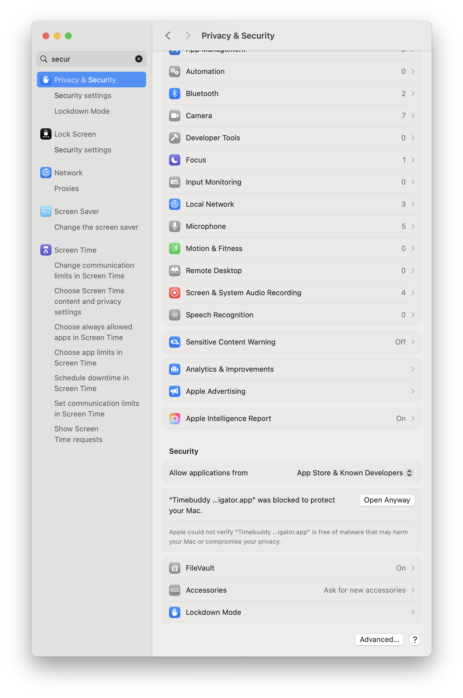
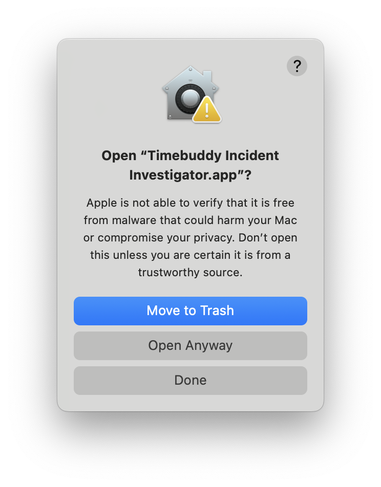
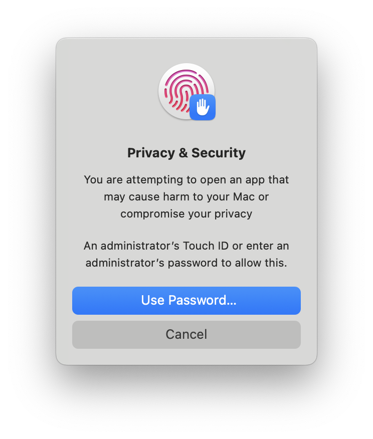
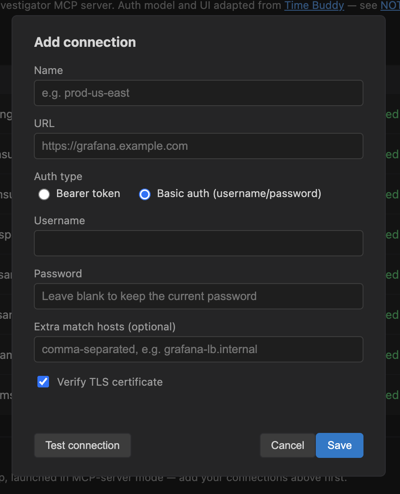
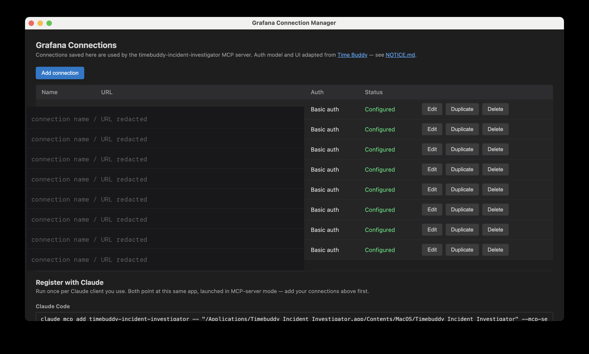
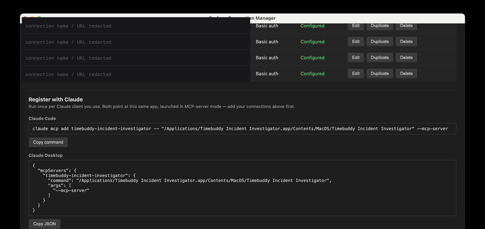
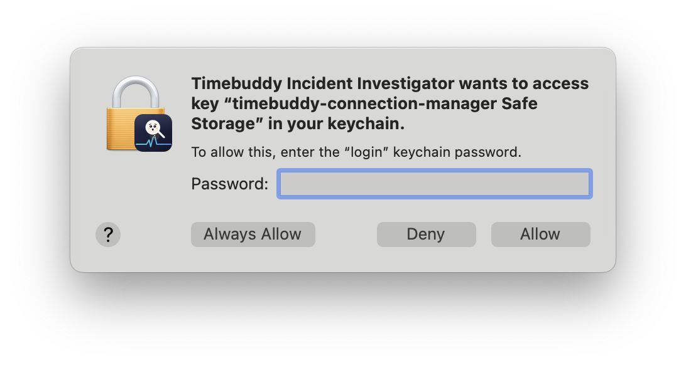

# Timebuddy Incident Investigator

AI-powered investigation of dashboards, metrics, and logs during incidents.

A Grafana Incident Review MCP server: it gives an AI agent safe, read-only, structured
access to a Grafana instance so it can do the first 30-60 minutes of an SRE's incident
investigation — identify what fired, replay the underlying queries, compare against
baseline periods, search for correlated signals elsewhere, and hand back an
evidence-linked verdict for a human to act on.

Most people never call the tools below by name — three bundled Claude Code skills (see
["Skills"](#skills) below) chain them automatically. Using Claude Desktop, or another MCP
client without skill/plugin support? The tools table below is the whole interface — the
agent calls those directly instead.

This page covers downloading, installing, configuring, and using the app. Developing or
building it instead? See [`CONTRIBUTING.md`](CONTRIBUTING.md).

## Skills

Three Claude Code skills chain the tools below in the right order automatically, so
nobody needs to know a tool name or the right call order — paste an alert link, ask what's
connected, or ask to export a panel, and the right one takes it from there:

| Skill | Use it when | What it does |
| --- | --- | --- |
| `/timebuddy:explore` | Checking that the Grafana MCP setup works, doing a health check, or just seeing what's connected — before an incident happens | Confirms the server is connected, surveys available connections/dashboards, and flags which are alert-backed (and therefore trustworthy) |
| `/timebuddy:investigate` | Something's paged, someone pasted an alert/incident link, or you're asking "what's going on with X" | Ingests the alert, replays its queries over the incident window, checks baselines, looks for correlated signals elsewhere, and writes an evidence-linked verdict with clickable links |
| `/timebuddy:export` | Someone asks to export, archive, or hand off a panel's data or chart — for a report, a postmortem, or a presentation | Resolves the exact panel from a URL and a panel name, writes its data to a CSV file, and optionally grabs a screenshot alongside it |

See ["Claude Code skills"](#claude-code-skills) below for how to install them — they're
bundled with the desktop app, so it's usually a couple of clicks, no separate download.

## MCP tools

| Tool | Purpose |
| --- | --- |
| `get_alert_context` | Ingest an alert (webhook payload, pasted JSON, or a dashboard/panel/alert-rule URL) and resolve it to dashboard UID, panel ID, labels, threshold, and time range. Also attaches a matching "Timebuddy knowledge" panel when one has been published (see below). |
| `get_product_context` | Look up a "Timebuddy knowledge" panel directly by product key, without an alert in hand. |
| `fetch_dashboard` | Fetch a dashboard's metadata, panel list, and template variables — from a dashboard/panel/alert-rule URL (connection auto-detected) or a `dashboardUid` directly. Useful for finding a panel's id/type from its title before calling another tool by name. |
| `resolve_panel_queries` | Extract a panel's query targets with variables substituted (using `var-*` overrides from the alert link where available). |
| `execute_query_window` | Replay a panel's queries for the incident window, a pre-window buffer, and baseline control windows. Optional `threshold`/`thresholdDirection` returns each series' precise dip/spike run(s) — start, end, duration, min/max — instead of leaving that to be eyeballed from raw points. `includePoints: false` drops each series' raw points (stats/runs are still returned) for a wide window that would otherwise overflow. |
| `render_dashboard` | One-shot "what does this dashboard show right now": executes every queryable panel on a dashboard/panel/alert-rule URL (or `dashboardUid`) for a single window — no pre-window buffer, no baseline controls — instead of chaining `fetch_dashboard` -> `resolve_panel_queries` -> `execute_query_window` per panel. `includePoints: false` drops raw points from every panel's series for a compact, stats-only survey. A panel mirroring another via Grafana's built-in "-- Dashboard --" datasource (see below) is reported with `mirrorsPanelIds`, never executed or errored. |
| `export_panel_csv` | Writes one panel's data to a CSV file on disk, for archiving/reporting/presentations or further analysis elsewhere. In the Electron app, first tries to capture the panel's real on-screen data by driving a hidden browser to Grafana's own Inspect > Data view with "Apply panel transformations" checked (`transformationsApplied: true` in the result) — so a join/reduce/rename configured on the panel comes back exactly as shown, not just the raw query result. Otherwise (no transformations configured, or no Electron/`screenshotter`) falls back to a direct export: table panels as-is (every raw column); timeseries/graph panels pivoted wide (one UTC-timestamp column plus one column per series). |
| `screenshot_panel` | *Electron app only.* Captures a real screenshot of one panel exactly as Grafana renders it, via a hidden browser window — for seeing a chart's actual shape, or reading a table/matrix panel whose transformed, on-screen content isn't visible in any raw query result. Returns the image inline plus a clickable Grafana link, and always saves the PNG to disk (`savedTo`). The one tool whose output is **not** passed through the redaction layer. |
| `find_related_dashboards` | Reverse-index lookup: which other dashboards use a given metric or share label values with the alert. Also surfaces `alertBackedDashboards` and `knowledgeDashboards` (with their published product keys) as standing overviews, independent of any search term. |
| `detect_correlated_anomalies` | Rank candidate panels by deviation strength, label overlap, and anomaly-onset timing vs. the primary alert. When auto-discovering, checks one `scope` tier per call — `product` (default; the primary dashboard plus its Timebuddy knowledge panel's declared ops/SLI dashboards and dependencies, or just the primary dashboard alone with no knowledge published), `connection`, then `all-connections` — so a caller can report each tier's result and only pay for a wider, more expensive search when the narrower one didn't answer it. |
| `validate_baseline` | Z-score classification of the incident window vs. prior-hour/day/week baselines, flagging recurring patterns. |
| `summarize_findings` | Deterministic verdict assembly (`real-anomaly` / `likely-false-positive` / `inconclusive`) plus an evidence bundle — it does not generate prose; the calling agent writes the human-readable note from this bundle. |
| `list_datasources` | List a connection's configured datasources (uid/name/type/default) — mainly for checking whether a panel's literal-name datasource reference still exists under some other UID. |
| `discover_influxdb_schema` | Queries an InfluxDB datasource directly for its own measurement/field/tag schema — not dashboarded data. A last-resort fallback for when `find_related_dashboards` finds nothing for a metric you have independent evidence should exist (index-builder only ever knows about metrics some panel already visualizes). Requires a `searchTerm`; there's no "list everything" mode by design. InfluxDB only, for now. |

## Setup

There's one app to install: run it, add your Grafana connection(s) yourself (each person
authenticates as themselves — a personal Bearer token or your own username/password —
instead of everyone sharing one admin-provisioned service-account token), then register it
with whichever Claude client you use. No separate MCP server process, no env vars to
hand-edit, no plaintext credential file anywhere.

1. Download the latest build for your platform from
   [GitHub Releases](https://github.com/misterbisson/timebuddy-incident-investigator/releases)
   and install it. (On macOS, the first launch hits a Gatekeeper block since this build
   isn't notarized yet — see
   ["Installing a downloaded build (macOS)"](#installing-a-downloaded-build-macos) below
   for the click-through.)
2. Add a connection for each Grafana endpoint you use (one per region/tier, etc.) —
   Bearer token or Basic auth, your choice. "Test connection" before saving. (See
   ["Configuring connections"](#configuring-connections) below for a walkthrough with
   screenshots.)
3. In the app's "Register with Claude" section, copy the command (Claude Code) or JSON
   snippet (Claude Desktop) shown there — it already has this app's own path filled in —
   and add it to your Claude client. A third block, "Claude Code skills (optional)", gives
   two `claude plugin` CLI commands that register the skills below — they're bundled with
   the app itself (see ["Claude Code skills"](#claude-code-skills) below), so this needs no
   GitHub access and no separate download, and it stays pinned to whichever app version you
   have installed. On macOS, the first time Claude actually starts the app as an MCP
   server, expect a keychain access prompt — see
   ["Registering with Claude"](#registering-with-claude) below for what it looks like and
   why it's expected.

Adding, editing, or removing a connection later takes effect immediately for any MCP
server that's already running — it's picked up on the very next tool call, no restart
needed. (Restarting the connection-manager GUI window itself does nothing for this — it's
a separate process from the one your Claude client is already talking to.)

For local development or CI, where there's no interest in the desktop app, the standalone
CLI still works on its own with a single connection from env vars — see
[`CONTRIBUTING.md`](CONTRIBUTING.md#running-the-standalone-cli).

## Installing a downloaded build (macOS)

Grab the latest build for your platform from
[GitHub Releases](https://github.com/misterbisson/timebuddy-incident-investigator/releases).

The macOS build is currently signed with a self-signed certificate, not a real Apple
Developer ID (see [`electron/CONTRIBUTING.md`](electron/CONTRIBUTING.md#building-signing-and-releasing))
— so Gatekeeper blocks it as an unverified app on first launch. On current macOS (Sequoia
and later), the old "right-click the app → Open" bypass no longer clears this particular
block; it has to be allowed from System Settings instead. This is the same click-through
for every release until real Developer ID signing/notarization lands:

1. Open the `.dmg` and drag `Timebuddy Incident Investigator.app` into **Applications**.

   

2. Double-click the app in **Applications**. macOS refuses to open it outright:

   

   Click **Done** (not "Move to Trash").

3. Open **System Settings → Privacy & Security**, scroll to the **Security** section at
   the bottom, and click **Open Anyway** next to the app's entry.

   

4. Confirm in the dialog that appears:

   

   Click **Open Anyway** again.

5. Authenticate with Touch ID or your admin password — macOS requires this before it'll
   actually launch an app it blocked:

   

The app opens normally after this and won't be re-blocked on subsequent launches. This
whole flow is only needed once per downloaded build; a rebuilt/re-downloaded `.app` (a
new version, or the same version re-signed) is quarantined again and needs it repeated.

Prefer the command line? Skip steps 2-5 with:

```bash
xattr -d com.apple.quarantine "/Applications/Timebuddy Incident Investigator.app"
```

## Configuring connections

Add a connection for each Grafana endpoint you use (one per region/tier, etc.) — each
person authenticates as themselves (their own Bearer token or Basic-auth
username/password) rather than everyone sharing one admin-provisioned service-account
credential.

1. Click **Add connection** and fill in a name, the Grafana URL, and either a Bearer
   token or Basic auth username/password:

   

2. Click **Test connection** before saving. It's cheap to do now, and catches a wrong
   URL, a bad credential, or a Grafana instance that isn't reachable from this machine
   immediately, instead of partway through an actual investigation later.

3. Click **Save**. Repeat for every Grafana endpoint you use — they all show up in one
   list, each editable/duplicable/deletable at any time:

   

   (Name/URL columns are blurred above — those are real connection details from a live
   setup; yours will show your own Grafana endpoints.)

### How connections are stored

Connections live under Electron's per-OS `userData` directory (shown in the app's UI,
with a "copy path" button), in two files:

- `connections.json` — non-secret metadata (name, URL, auth type, etc.), plaintext (it
  holds nothing sensitive).
- `secrets.enc.json` — every token/password, `safeStorage`-encrypted (backed by the OS
  keychain: macOS Keychain, Windows DPAPI, or libsecret on Linux). Decrypted only
  in-memory, only inside this same process, when `--mcp-server` mode needs to build a
  Grafana client — the decrypted form is never written back to disk.

Both files are written atomically (temp file plus rename), so an interrupted write or a
crash can't leave either one truncated.

If a connection's row shows **"Can't decrypt secret"**, its stored credential is still
there but this machine's keychain can no longer open it — most often after an OS
reinstall, a keychain reset, or migrating to a new machine. Edit that connection and
re-enter its token/password to fix it. Only that one connection is affected; the others
keep working normally, and tool calls that don't use it are unaffected.

## Registering with Claude

Once you've added your connections, the app's "Register with Claude" section shows a
ready-to-run `claude mcp add --scope user` command (Claude Code) and a ready-to-paste
`mcpServers` JSON snippet (Claude Desktop), both pointing at this app's own executable
path with `--mcp-server`. `--scope user` (not the "local" default) registers it once for
the whole machine/user rather than only the one project directory you happen to run the
command from — since this is one desktop app meant to be usable from any project:



(The redacted rows at the top are leftover connection entries visible from scrolling; the
`claude mcp add` command shown predates the `--scope user` addition — this section itself
has nothing connection-specific to redact.)

A third, optional block (not pictured above — its exact commands changed after this
screenshot was taken) registers the bundled Claude Code skills. It's two `claude plugin`
CLI commands rather than a settings.json paste:

```bash
claude plugin marketplace add "/Applications/Timebuddy Incident Investigator.app/Contents/Resources/plugin" --scope user
claude plugin install timebuddy@timebuddy-incident-investigator --scope user
```

(the app's own UI fills in the first command's path for you — this is just the shape).
The marketplace/plugin ids aren't arbitrary: they're read from that bundle's own
`.claude-plugin/marketplace.json`/`plugin.json` `name` fields, so the second command is
fixed as long as those files don't change. `--scope user` writes both to
`~/.claude/settings.json` (`extraKnownMarketplaces` + `enabledPlugins`) for this
machine/user. Skills show up immediately, no restart needed — only the MCP server itself
needs a client restart to reconnect.

**macOS only:** the *first* time Claude actually starts this app as an MCP server (which
can be a while after you registered it above — not until your Claude client's next
session, or the next time it decides to spawn the server), macOS will prompt for keychain
access to decrypt your saved connection credentials:



This is expected — **Allow** (or **Always Allow**, to skip the prompt on future
launches) it. If you don't recognize this prompt when it appears, it's this app's own
`safeStorage`-encrypted connection secrets being decrypted (see
["How connections are stored"](#how-connections-are-stored) above), not anything else
asking for your keychain.

## Claude Code skills

This repo also ships as a Claude Code plugin (`.claude-plugin/plugin.json`) with three skills
that drive the tools above so nobody needs to know the tool names or the right call order.

The Electron app bundles this same plugin, so the easiest way to install it is the
"Claude Code skills (optional)" block in the app's own "Register with Claude" section —
see ["Registering with Claude"](#registering-with-claude) above for the exact commands and
what they do.

Prefer installing from GitHub instead (e.g. no desktop app, or want plugin updates
independent of the app's release cadence)? The same plugin is installable as a normal
Claude Code marketplace:

```
/plugin marketplace add misterbisson/timebuddy-incident-investigator
/plugin install timebuddy@timebuddy-incident-investigator
```

Either way, skills show up under the `/timebuddy:` namespace:

- `/timebuddy:explore` — a low-stakes health check: confirms the MCP server is connected,
  surveys what connections/dashboards exist, and highlights which dashboards are actually
  alert-backed (and therefore trustworthy) before an incident happens.
- `/timebuddy:investigate` — the reactive path: ingests an alert (a pasted URL, alert JSON,
  or webhook payload), replays it, checks baselines, looks for correlated signals, and
  writes an evidence-linked incident note.
- `/timebuddy:export` — given a dashboard/panel URL and a panel name (or a direct panel link),
  resolves the exact panel, writes its data to a CSV file, and optionally grabs a screenshot
  alongside it — for archiving, reporting, or a presentation.

See [`skills/explore/SKILL.md`](skills/explore/SKILL.md),
[`skills/investigate/SKILL.md`](skills/investigate/SKILL.md), and
[`skills/export/SKILL.md`](skills/export/SKILL.md) for the exact pipeline each one follows.

## Activity window

Once your Claude client has started this app as your MCP server (it does this on its own
whenever it needs the server — see ["Registering with Claude"](#registering-with-claude)
above), a companion "Timebuddy Activity" window appears the moment Claude actually queries
its first dashboard/panel — not as soon as Claude starts, so nothing pops up before an
investigation begins. It's a live, clickable log of what's being inspected: each entry is
one panel Claude actually pulled data from or screenshotted (not every dashboard/panel link
that happens to be mentioned in a response — see `src/tools/shared.ts`'s `recordActivity`
for exactly which tool calls log an entry and why). Clicking an entry shows either the
screenshot `screenshot_panel` saved for it, or a live, authenticated view of the real
Grafana panel in an embedded `<webview>` — authenticated the same way `screenshotter.js`'s
one-shot captures are (a connection's own bearer/basic header injected via `webRequest`),
just against a long-lived, persistent session instead of a destroy-after-one-shot window
(see `setupLiveViewSession` in `electron/src/main.js`).

The log is in-memory only, for as long as that server keeps running — closing or
restarting your Claude client (which restarts the server) clears it, and nothing is ever
written to disk.

## Multiple Grafana connections

Every tool takes an optional `connection` parameter (a connection id). When it's
omitted:

- `get_alert_context` auto-detects the right connection by matching the alert's own
  URL (panel/dashboard/generator link) against each configured connection's `url` (or its
  `matchHosts`, for cases like a load balancer alias) — and returns `resolvedConnectionId`
  for you to pass into every subsequent call for that incident.
- Single-target tools (`resolve_panel_queries`, `execute_query_window`, `validate_baseline`,
  `get_product_context`, `list_datasources`, and the primary panel in `detect_correlated_anomalies`)
  fall back to the one configured connection if there's only one, otherwise error out listing the
  available connection ids — they never guess. `fetch_dashboard`, `render_dashboard`,
  `export_panel_csv`, and `screenshot_panel` additionally auto-detect the connection from a `url`'s
  host (before the same fallback), the same way `get_alert_context` does.
- The two search tools (`find_related_dashboards`, and `detect_correlated_anomalies` when
  auto-discovering candidates) fan out across every configured connection and merge
  results, each tagged with its `connectionId`.

The single-connection fallback only applies when nothing contradicts it. If you pass a URL
whose host matches no configured connection, that's an error listing the available ids —
even with exactly one connection configured — rather than a silent fall back to it, which
would investigate a different Grafana than the one the link points at. Add the host to that
connection's `matchHosts` if it's an alias for one of them.

See [`docs/BEHAVIOR.md`](docs/BEHAVIOR.md) for how this project handles a few Grafana edge
cases: the product-knowledge-dashboard convention for publishing institutional knowledge
(what a panel means, known false positives, runbook links), live resolution of "all"
dashboard variables, and Grafana's "-- Dashboard --" pseudo-datasource panels.

## Security model

- The Grafana client (`src/grafana/client.ts`) is a fixed allowlist of read-only endpoints.
  There is no "make an arbitrary Grafana request" tool — nothing built on top of it can
  reach a mutating endpoint, even if asked to.
- `security/limits.ts` caps query time-range span and max data points, and caps
  concurrent outgoing Grafana requests.
- `security/redact.ts` masks secret-shaped fields and any configured
  customer-identifier patterns before data is returned to the model.
- `security/audit.ts` appends every tool invocation to a local JSONL audit log.
- The optional webhook listener (`npm run webhook`) binds `127.0.0.1` and accepts only
  `POST /`. See "Receiving alerts by webhook" below before exposing it more widely.
- A per-user Bearer token or Basic-auth login (via the connection manager) no longer
  carries the "Viewer-role service account" defense-in-depth layer that a shared token
  gave you — whatever role that person actually has in Grafana applies. The read-only
  guarantee then rests entirely on the client allowlist above, which is why that allowlist
  has no generic escape hatch. A Viewer-scoped service-account token remains the more
  defense-in-depth choice for a shared/CI connection.

## Receiving alerts by webhook

Optional. Point a Grafana webhook contact point at this listener and `get_alert_context`
with no arguments will pick up the most recent alert it received:

```bash
npm run webhook     # listens on 127.0.0.1:4318, appends to $DATA_DIR/alerts.jsonl
```

It accepts only `POST /` with a Grafana Alertmanager body, never contacts Grafana, and
has no other routes.

**It binds loopback by default, which assumes Grafana runs on the same host.** If yours
doesn't, you need a wider bind — and you should set a shared secret at the same time:

```bash
WEBHOOK_BIND_ADDRESS=0.0.0.0
WEBHOOK_TOKEN=<a long random string>
```

With `WEBHOOK_TOKEN` set, every request must carry `Authorization: Bearer <token>`;
configure the same value as the Authorization header on the Grafana contact point.
Binding wide *without* a token logs a startup warning, because anything posted to this
port becomes the incident that `get_alert_context` hands to the investigating agent — an
unauthenticated open port here is a way to feed that agent attacker-chosen content, not
just a way to fill a disk.

`alerts.jsonl` currently grows without bound; rotation is
[tracked separately](https://github.com/misterbisson/timebuddy-incident-investigator/issues/71).

## Known limitations (MVP)

- InfluxQL support covers raw-query-mode targets and does a best-effort reconstruction
  for structured query-builder targets; it doesn't replicate Grafana's full InfluxQL
  query builder.
- The metric index doesn't detect *unused* metrics (ones that exist in a datasource but
  appear in no dashboard) — only the reverse lookup (metric -> dashboards) and dashboards
  pointing at a datasource UID that no longer exists.
- `detect_correlated_anomalies` ranks candidates with a heuristic (z-score magnitude ×
  label overlap × onset-timing proximity), not a statistical correlation/causation test.
- The Electron app isn't notarized yet (macOS signing is currently a self-signed
  certificate, not a real Apple Developer ID — see `electron/SELF_SIGNED_SETUP.md`).
  Downloaded builds hit a Gatekeeper block on macOS (see
  ["Installing a downloaded build (macOS)"](#installing-a-downloaded-build-macos) above
  for the click-through) or SmartScreen warnings on Windows, until it's signed/notarized
  with a real developer identity — a prerequisite for wider rollout, not something fixable
  in code.
- `export_panel_csv`'s Grafana-side transformation capture (see the tools table above) is
  Electron-only, and depends on the exact visible text/DOM structure of Grafana's Inspect
  drawer rather than a published API — it's expected to be more version-sensitive than the
  rest of this project's Grafana integration. When it's unavailable (standalone CLI) or a
  panel has no transformations configured, or the capture attempt itself fails, the tool
  falls back to its own direct export: a table panel backed by more than one query/frame is
  then written to one CSV file per frame, not a merged table.
- **CSV files captured from Grafana byte-for-byte are not neutralized against spreadsheet
  formula injection.** A cell beginning with `=`, `+`, `-`, or `@` is executed as a formula
  when the file is opened in Excel, LibreOffice, or Google Sheets. This server's *own*
  exports prefix such cells with an apostrophe so they display instead of executing; a file
  captured from Grafana is that tool's own bytes and can't be rewritten without ceasing to
  be a faithful copy. The result says which you got — `formulaNeutralized` — so check it
  before opening a captured file in a spreadsheet, or handing one to someone else.

## Acknowledgments

The `electron/` connection-manager app's UI and auth model are adapted from
[Time Buddy](https://github.com/Liquescent-Development/time-buddy) by Richard Kiene /
Liquescent Development (AGPL-3.0-only, the same license this repository uses). See
[`NOTICE.md`](NOTICE.md) for exactly what was adapted and what was deliberately changed
(credential storage, most notably).
