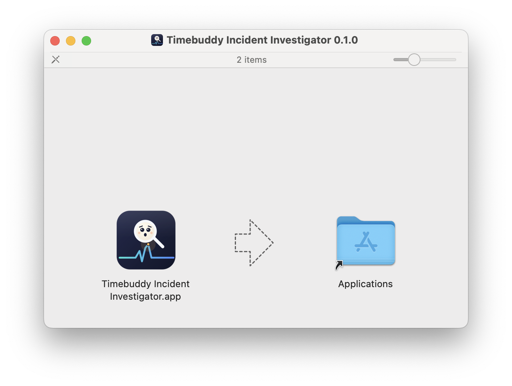
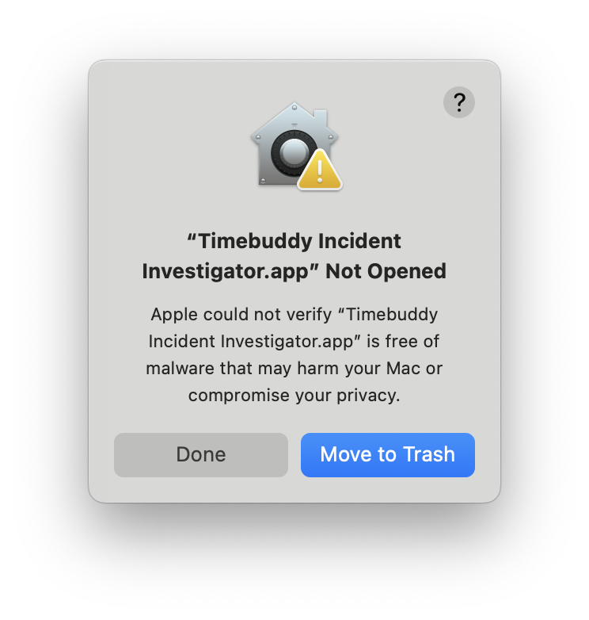

# Grafana connection manager (and the MCP server itself)

One Electron app, two modes:

- Launched normally (double-click, `npm run dev`/`npm start`), it's a small GUI for
  managing Grafana connections, so each person authenticates as themselves (a personal
  Bearer token or their own Basic-auth username/password) instead of everyone sharing one
  admin-provisioned service-account token — and so an environment with more than one
  Grafana endpoint (per region/tier, etc.) can have all of them registered in one place.
- Launched with a `--mcp-server` flag — which is how Claude Code/Desktop should be
  configured to run it — it skips the window entirely and *is* the
  `timebuddy-incident-investigator` MCP server, talking to its client over stdio.

Both modes are the same binary and the same process type, which is what lets connection
secrets stay `safeStorage`-encrypted end to end: there's no separate server process that
can't call `safeStorage`, so there's never a reason to write a credential to disk in
plaintext.

The connection-list UI and auth model are adapted from
[Time Buddy](https://github.com/Liquescent-Development/time-buddy) — see
[`../NOTICE.md`](../NOTICE.md) for what was and wasn't carried over. Unlike Time Buddy,
this app is scoped to connection management (plus being the MCP server): no query IDE, no
AI analytics, no charting.

## Running

```bash
cd electron
npm install        # also links the root engine package via the npm workspace
npm run dev         # builds the root package, then opens the GUI
```

To run in MCP-server mode directly (what Claude Code/Desktop will do):

```bash
electron . --mcp-server
```

## How it stores data

Connections live under Electron's per-OS `userData` directory (shown in the app's UI,
with a "copy path" button), in two files:

- `connections.json` — non-secret metadata (name, URL, auth type, etc.), plaintext (it
  holds nothing sensitive).
- `secrets.enc.json` — every token/password, `safeStorage`-encrypted (backed by the OS
  keychain: macOS Keychain, Windows DPAPI, or libsecret on Linux). Decrypted only
  in-memory, only inside this same process, when `--mcp-server` mode needs to build a
  Grafana client — the decrypted form is never written back to disk.

## Activity window

While running in `--mcp-server` mode, this app also shows a companion "Timebuddy
Activity" window — created the moment the first dashboard/panel is actually queried (not
at process start, so nothing pops up before an investigation begins). It's a live,
clickable log of what's being inspected: each entry is one panel a tool call actually
pulled data from or screenshotted (not every dashboard/panel link a tool result happens to
mention — see `src/tools/shared.ts`'s `recordActivity` for exactly which tool calls log an
entry and why). Clicking an entry shows either the screenshot `screenshot_panel` saved for
it, or a live, authenticated view of the real Grafana panel in an embedded `<webview>` —
authenticated the same way `screenshotter.js`'s one-shot captures are (a connection's own
bearer/basic header injected via `webRequest`), just against a long-lived, persistent
session instead of a destroy-after-one-shot window (see `setupLiveViewSession` in
`main.js`).

The log is in-memory only, for this MCP-server process's lifetime — nothing is written to
disk, and it resets on restart.

## Installing a downloaded build (macOS)

The macOS build is currently signed with a self-signed certificate, not a real Apple
Developer ID (see "Building, signing, and releasing" below) — so Gatekeeper blocks it as
an unverified app on first launch. On current macOS (Sequoia and later), the old
"right-click the app → Open" bypass no longer clears this particular block; it has to be
allowed from System Settings instead. This is the same click-through for every release
until real Developer ID signing/notarization lands:

1. Open the `.dmg` and drag `Timebuddy Incident Investigator.app` into **Applications**.

   

2. Double-click the app in **Applications**. macOS refuses to open it outright:

   

   Click **Done** (not "Move to Trash").

3. Open **System Settings → Privacy & Security**, scroll to the **Security** section at
   the bottom, and click **Open Anyway** next to the app's entry.

   

4. Confirm in the dialog that appears:

   

   Click **Open Anyway** again.

5. Authenticate with Touch ID or your admin password — macOS requires this before it'll
   actually launch an app it blocked:

   

The app opens normally after this and won't be re-blocked on subsequent launches. This
whole flow is only needed once per downloaded build; a rebuilt/re-downloaded `.app` (a
new version, or the same version re-signed) is quarantined again and needs it repeated.

Prefer the command line? Skip steps 2-5 with:

```bash
xattr -d com.apple.quarantine "/Applications/Timebuddy Incident Investigator.app"
```

## Registering with Claude

Once you've added your connections, the app's "Register with Claude" section shows a
ready-to-run `claude mcp add` command (Claude Code) and a ready-to-paste `mcpServers` JSON
snippet (Claude Desktop), both pointing at this app's own executable path with
`--mcp-server`. See the root [`README.md`](../README.md) for the full setup flow.

## Testing

`test/mcpServerMode.mjs` seeds a connection directly through `connectionStore.js` (bypassing
the GUI), then spawns this app's real binary in `--mcp-server` mode using the actual
`@modelcontextprotocol/sdk` `Client`/`StdioClientTransport` — the same mechanism a real MCP
client uses — and confirms `tools/list` returns the full expected tool set and a tool call reaches a real
network attempt using the seeded, `safeStorage`-decrypted credential (not a
connection-resolution error). Run it with:

```bash
node test/mcpServerMode.mjs
```

No live Grafana instance is required; the seeded connection points at a placeholder URL
specifically so the test can assert the call got *past* connection resolution, not that it
succeeded against a real Grafana.

## Building, signing, and releasing

Packaging is `electron-builder`, configured in this package's `build` field in
`package.json` — adapted from Time Buddy's own setup (`build.js`/`release.yml` in
[Liquescent-Development/time-buddy](https://github.com/Liquescent-Development/time-buddy),
see [`../NOTICE.md`](../NOTICE.md)):

```bash
cd electron
npm run build-mac    # or build-win / build-linux
```

Each of those first runs the root package's `tsc` build (`npm run build --prefix ..`) so
the engine's `dist/` is current, then invokes `electron-builder` for that platform. Output
lands in `electron/dist/`.

`.github/workflows/release.yml` builds all three platforms on every push/PR to `main`;
pushes to `main` also publish to GitHub Releases (`electron-builder`'s own `publish:
github` config, so `electron-updater` — not yet wired into `main.js` — can eventually
point at those release artifacts).

**macOS signing is currently a self-signed certificate**, not a real Apple Developer ID —
see [`SELF_SIGNED_SETUP.md`](SELF_SIGNED_SETUP.md) for what that does and doesn't buy you
(short version: `afterSign` runs `scripts/afterSign.js`, which signs but can't notarize
without real Apple credentials, so downloaded builds still hit a Gatekeeper block — see
"Installing a downloaded build (macOS)" above for the click-through). Windows and Linux
builds are unsigned entirely, same as upstream Time Buddy.
